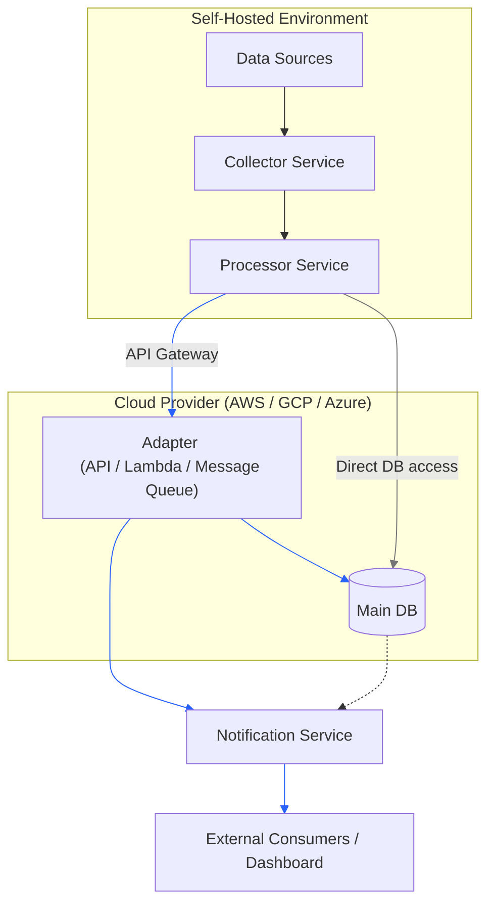

**Hybrid Cloud Architecture** where the core data persistence resides in a managed cloud service (like AWS), while the data ingestion and processing logic runs on self-hosted (or private cloud) infrastructure.

---

### 🧩 Component Breakdown

#### 1. Main DB (Cloud-Hosted)
*   **Role**: Single Source of Truth (SSOT).
*   **Requirement**: Must be accessible from the self-hosted network via secure channels.

#### 2. Self-Hosted Collector Service
*   **Role**: Ingests raw data from various sources (APIs, files, IoT devices, logs).
*   **Requirement**:
    *   Batch or streaming ingestion.
    *   Basic validation (schema check).
    *   Temporary buffering (e.g., Redis or local disk) to handle network spikes.

#### 3. Self-Hosted Processor Service
*   **Role**: Transforms, cleans, and enriches raw data before storage.
*   **Requirement**:
    *   Data transformation logic.
    *   Error handling and retry mechanisms.
    *   **Direct DB Injection**: Uses a secure connection to write processed data into the Cloud DB.

#### 4. Notification Service
*   **Role**: Alerts downstream systems that new data is available.
*   **Mechanisms**:
    *   **Webhooks**: POST request to external endpoints.
    *   **Message Queue**: Publish to queue.
    *   **Event Stream**: Publish Event.

---

### 🔄 Data Flow Sequence

1.  **Ingestion**: The **Collector Service** pulls raw data from sources.
2.  **Processing**: Data is passed to the **Processor Service**.
    *   *Validation*: Check if data meets schema requirements.
    *   *Transformation*: Clean, aggregate, or enrich data.
3.  **Injection**: The **Processor Service** writes the processed data directly into the **Cloud Main DB** or to **API gateway**.
    *   *Batch vs. Real-time*: Decide based on latency requirements.
4.  **Notification**: Upon successful DB write, the **Adapter** triggers the **Notification Service**.
5.  **Consumption**: External systems (dashboards, APIs) receive the notification and fetch/query the new data from the Cloud DB.

---

### 🔒 Security & Connectivity Design (Critical)

Since your self-hosted service needs to write directly to a cloud database, security is paramount.

#### Option A: VPC Peering / Direct Connect (Recommended for High Security)
*   Establish a **VPC Peering** connection between your self-hosted network and the Cloud VPC.
*   Use **Private IPs** for communication.
*   **Database Security**:
    *   Place the DB in a **Private Subnet** (no internet access).
    *   Use SSL/TLS certificates for connection.
    *   Restrict DB access to only the self-hosted service’s IP range.

#### Option B: VPN Tunnel (Easier Setup)
*   Set up an **Site-to-Site VPN** or **Client VPN**.
*   Self-hosted service connects through the VPN tunnel to the Cloud DB.
*   Ensure encryption is enforced at the application layer (TLS).

#### Option C: API Gateway + Lambda (Indirect Injection)
*   Instead of direct DB access, the self-hosted service sends data to an **API Gateway**.
*   API Gateway triggers a **Lambda Function** that writes to the DB.
*   *Pros*: No need for direct DB connectivity; better audit trails.
*   *Cons*: Slight latency increase; cost per invocation.

**Recommendation**: For high-volume data, use **Option A (VPC Peering)** with direct DB access. For low-volume or simpler setups, use **Option C**.

---

### ⚙️ Implementation Details

#### 1. Database Injection Strategy
*   **Batch Writes**: Collect data in memory/buffer and insert in chunks (e.g., every 100 records or every 5 seconds) to reduce DB load.
*   **Upsert Logic**: Use `INSERT ... ON CONFLICT DO UPDATE` (PostgreSQL) to handle duplicates.
*   **Connection Pooling**: Use a connection pooler (e.g., PgBouncer for PostgreSQL) to manage DB connections efficiently.

#### 2. Notification Mechanism
*   **Event-Driven**: After a successful DB write, publish an event:
*   **Delivery**:
    *   **Webhooks**: Send HTTP POST to registered endpoints.
    *   **Cloud Pub/Sub**: Publish to _Message Queue_ for reliable delivery.

#### 3. Error Handling & Retry
*   **Transient Errors**: If DB write fails due to network issues, retry with exponential backoff.
*   **Dead Letter Queue (DLQ)**: If data fails processing after N retries, send it to a DLQ for manual inspection.
*   **Idempotency**: Ensure that retrying a write does not create duplicate records.

---

### 📊 Monitoring and Observability

1.  **Metrics**:
    *   Data ingestion rate (records/sec).
    *   Processing latency (time from collection to DB write).
    *   DB write success/failure rate.
    *   Notification delivery success rate.
2.  **Alerting**:
    *   Alert if DB write failures exceed threshold.
    *   Alert if notification delivery fails.
  
---

### ⚖️ Benefits and Drawbacks

| Scenario | Benefit |
| :--- | :--- |
| **Security** | Raw data never leaves your control; only clean data goes to cloud. |
| **Cost** | Pay for cloud storage, not cloud compute/processing. |
| **Performance** | Cloud consumers get low-latency access to data. |
| **Compliance** | Easier to meet data residency requirements. |

To ensure these benefits are realized, you **must** address these challenges:

1.  **Network Stability**: The connection between self-hosted and cloud must be reliable. If the link drops, your self-hosted service **must** have a local buffer (queue) to store data until the connection is restored. Otherwise, you lose data.
2.  **Security of the Tunnel**: Since you are opening a path from self-hosted to cloud DB, you **must** use VPC Peering or a Site-to-Site VPN. Never expose the DB port directly to the public internet.
3.  **Data Consistency**: Ensure your "Direct Injection" uses transactions. If the notification fails after the DB write, you need a mechanism to retry the notification without duplicating the data.

| Scenario | Drawbacks |
| :--- | :--- |
| **High-Frequency Real-Time Data** | Network latency will make real-time updates impossible. Use Cloud-native streaming (Kinesis/PubSub) instead. |
| **Unreliable Network Connection** | If your self-hosted location has poor internet or weak server recovery, data loss is likely. |
| **Small Team / Low DevOps Maturity** | Managing two infrastructures + security tunnels + retry logic is too complex for a small team. |
| **Massive Scale (Millions of writes/sec)** | Your network bandwidth will bottleneck before your DB does. |

